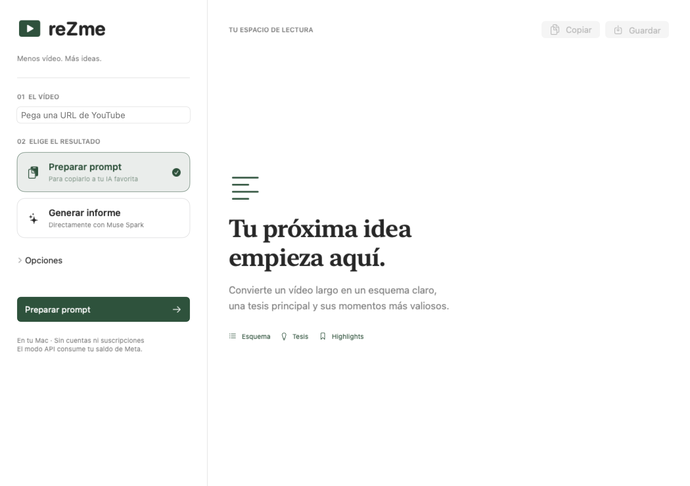

# reZme

**Menos vídeo. Más ideas.** Una aplicación para Mac que convierte vídeos de YouTube en un esquema, una tesis principal y sus momentos más valiosos.



## Dos maneras de usarla

- **Preparar prompt:** obtiene la transcripción y prepara las instrucciones para copiar a la IA que prefieras. No necesita clave API ni llama a Meta.
- **Generar informe:** utiliza tu propia clave de Meta Model API y Muse Spark para entregar el informe directamente. El proveedor factura el consumo a tu cuenta.

Copia el resultado, edítalo o guárdalo como Markdown. También puedes pegar una transcripción si YouTube no permite descargarla.

## Instalar en Mac

Esta primera versión se instala **desde el código fuente**. No hay un instalador universal ni una aplicación notarizada para descargar. Probada en Apple Silicon; la compatibilidad con Intel no está verificada. Requiere macOS 14 o posterior y herramientas de Apple capaces de compilar SwiftUI.

### 1. Preparar los requisitos (solo una vez)

Instala las [herramientas de desarrollo de Apple](https://developer.apple.com/xcode/resources/):

```sh
xcode-select --install
```

Necesitas Python 3.12 y FFmpeg. Si usas [Homebrew](https://brew.sh/):

```sh
brew install python@3.12 ffmpeg
```

### 2. Descargar el proyecto

Descárgalo desde **Code → Download ZIP**, descomprímelo en una carpeta permanente, o clónalo:

```sh
git clone https://github.com/AlexLaraMerino/reZme.git
cd reZme
```

### 3. Instalar y abrir

Abre **Instalar.command** con doble clic. La instalación muestra una ventana de Terminal, crea el entorno de Python, descarga las dependencias y compila la aplicación. No pide claves API.

Si prefieres iniciarla desde Terminal:

```sh
bash Instalar.command
```

Se crea **reZme.app** dentro del proyecto y, si no existe ya, un acceso directo en el escritorio. A partir de entonces **abre el icono con doble clic: no necesitas Terminal para usarla**.

Conserva la carpeta del proyecto: la app depende de `.venv` y del Python instalado. Si cambias su ubicación, vuelve a preparar el entorno y el acceso directo. No copies únicamente el archivo `.app` a otro ordenador.

## Uso

1. Pega la URL de un vídeo de YouTube.
2. Elige **Preparar prompt** o **Generar informe**.
3. Para generar un informe, abre **Opciones** e introduce tu clave de Meta. El modelo inicial es `muse-spark-1.3`; puedes escribir otro identificador disponible en tu cuenta. Consulta la [documentación de Meta](https://github.com/meta-models/meta-model-cookbook).
4. Pulsa el botón principal y espera el resultado. Puedes cancelar el proceso.
5. Copia el texto o guárdalo antes de cerrar la app.

La aplicación busca subtítulos en español o inglés. Cuando no los encuentra, intenta descargar y transcribir el audio localmente con Whisper. **La primera transcripción descarga el modelo y puede tardar varios minutos**; las siguientes reutilizan ese modelo.

En **Opciones** puedes seleccionar la sesión de Chrome, Firefox o Safari si YouTube solicita iniciar sesión. macOS puede pedir permiso para acceder a los datos del navegador. También puedes pegar una transcripción: en ese caso se utiliza ese texto sin descargar el vídeo, manteniendo la URL como fuente.

## Datos y privacidad

- No hay cuentas propias de reZme, analítica, telemetría ni un servidor del proyecto.
- La clave API permanece en memoria durante la sesión; no se guarda en archivos ni se añade a los argumentos del proceso.
- En modo API se envía la transcripción o sus notas, metadatos e instrucciones a **Meta**. Se aplican las condiciones de tu proveedor y cuenta.
- Para obtener contenido se contacta con YouTube. La primera descarga del modelo local contacta con el repositorio del modelo en Hugging Face.
- Los archivos temporales se eliminan al terminar normalmente. Una interrupción abrupta puede dejar temporales del sistema. El modelo de Whisper queda en la caché local.
- No hay historial automático: guarda los informes que quieras conservar.

## Limitaciones conocidas

- YouTube puede cambiar su funcionamiento, limitar descargas o bloquear vídeos. No se garantiza acceso a cualquier URL.
- Las transcripciones automáticas y los informes de IA pueden contener errores. Comprueba las afirmaciones relevantes en la fuente.
- Se analiza **lo que se dice**, no las imágenes ni las diapositivas del vídeo.
- Los vídeos largos pueden requerir varias llamadas API; el coste depende del modelo y del uso.
- Los prompts largos pueden superar el contexto de la IA donde los pegues.
- La interfaz es para macOS y está en español. No se han probado Windows ni Linux.
- Usa contenido al que tengas acceso legítimo y respeta los derechos y las condiciones de los servicios. La licencia MIT cubre el código propio, no vídeos ni dependencias de terceros.

## Desarrollo y pruebas

```sh
.venv/bin/python -m unittest discover -s tests -v
.venv/bin/python desktop/build.py
```

| Archivo | Función |
| --- | --- |
| `desktop/ReZme.swift` | Interfaz nativa de macOS |
| `desktop/worker.py` | Comunicación con la interfaz y API de Meta |
| `yt_digest.py` | Subtítulos, transcripción, prompts y modos de terminal |
| `desktop/build.py` | Compilación local de la app y su icono |
| `requirements-desktop.txt` | Versiones directas probadas para la app |

Las pruebas automáticas usan respuestas simuladas para la API y no consumen saldo. Hay además una comprobación de compilación de la interfaz en GitHub Actions. Las dependencias transitivas no están congeladas: las versiones directas facilitan repetir la instalación, pero no constituyen una compilación idéntica byte a byte.

El script original conserva los modos de terminal `none`, `ollama`, `claude-code` y `api` (Anthropic). Sus dependencias opcionales están en `requirements.txt`; ese modo API es distinto del modo Meta de la interfaz. El modelo de Anthropic puede necesitar ajustarse a uno disponible en tu cuenta.

## Colaborar

Las mejoras y los informes de fallos son bienvenidos. Consulta [CONTRIBUTING.md](CONTRIBUTING.md). No publiques claves, cookies, transcripciones privadas ni archivos de tu navegador en los issues.

## Licencia

[MIT](LICENSE) · Alex Lara Merino.
